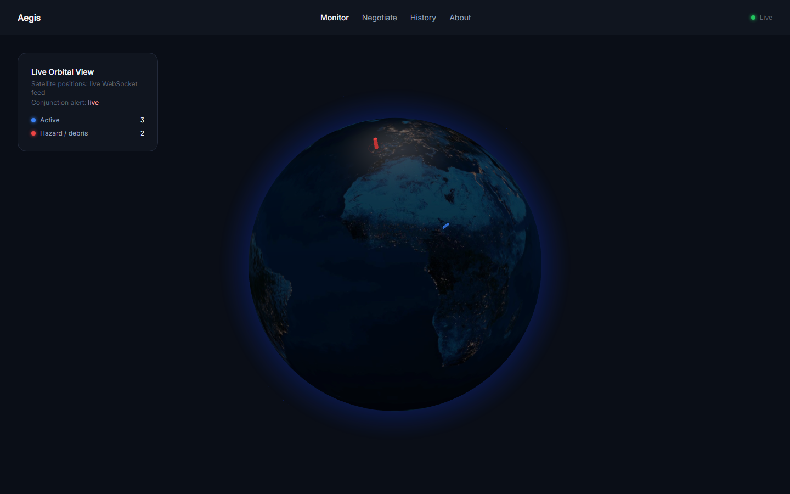
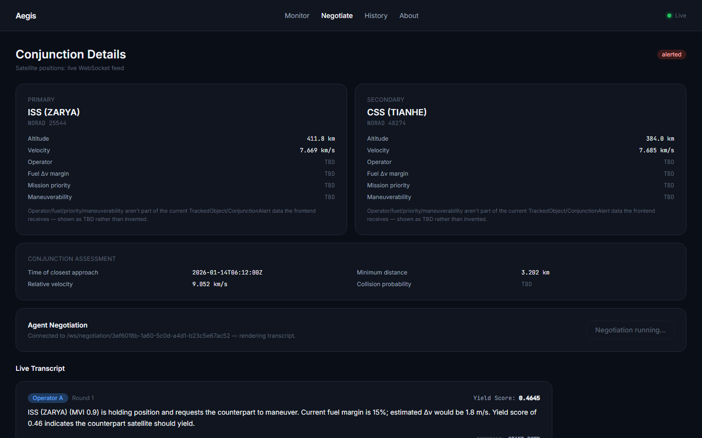
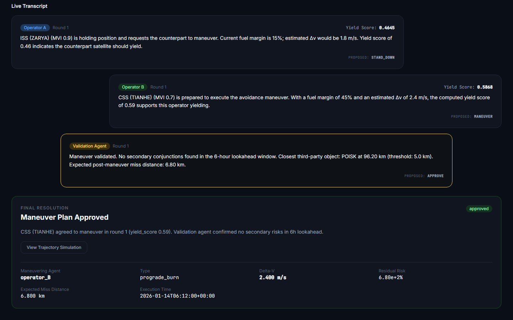

# Aegis

**Autonomous multi-agent orbital collision de-confliction.**

Aegis replaces the manual, email-based satellite collision-avoidance process
with autonomous negotiation agents — one per satellite operator — that detect
a real conjunction event, negotiate who maneuvers using real orbital physics
and mission-priority data, and produce a fully auditable resolution. No
standardized automated protocol exists for this today; Aegis is a working
demonstration of what one could look like.

> Built in 24 hours for Bit N Build - Around the World 2026 by a 4-person
> team, using real tracking data (CelesTrak) and real orbital mechanics
> (SGP4, Keplerian/J2 propagation) throughout.

---

## The Problem

When two satellites from different operators are on a collision course,
resolution today happens through manual emails between engineers — a real,
documented bottleneck (e.g. the 2019 SpaceX/ESA Starlink–Aeolus incident).
As LEO gets more crowded, this doesn't scale.

## What Aegis Does

1. **Detects** a real close-approach conjunction from live/cached CelesTrak
   TLE data, propagated with SGP4.
2. **Negotiates** — two autonomous operator agents reason over mission
   priority and fuel cost, exchange proposals over multiple rounds, and
   converge on who maneuvers. The negotiation number that actually decides
   the outcome (`yield_score`) always comes from deterministic Python — the
   LLM only narrates it in plain language.
3. **Validates** — a third agent re-propagates the proposed maneuver 6 hours
   forward to confirm it doesn't create a *new* collision risk before
   approving it. It can also honestly report "no safe maneuver found."
4. **Visualizes** — a live 3D globe shows the conjunction, the negotiation
   as it happens, and the resulting trajectory change.

---

## Screenshots

| Live Orbital View | Negotiation Console & Result |
|---|---|
|  |  |



---

## Architecture

```
CelesTrak (real TLE data)
        │
        ▼
Conjunction Monitor Agent (SGP4 propagation, deterministic)
        │  WebSocket: /ws/monitor
        ▼
┌─────────────────────────────────────┐
│ Operator Agent A  ◄──►  Operator Agent B │   ← yield_score always
│ (deterministic cost;  LLM narration)     │     deterministic;
└─────────────────────────────────────┘     LLM only narrates
        │
        ▼
Validation Agent (6h re-propagation safety check)
        │  WebSocket: /ws/negotiation/{id}
        ▼
React frontend — live 3D globe (react-globe.gl) + negotiation console
        │
        ▼
SQLite (session history)
```

**Backend:** FastAPI, WebSockets, `sgp4`, Pydantic, Anthropic API
**Frontend:** React + Vite, `react-globe.gl`, `satellite.js`, Tailwind CSS, Zustand
**Data:** CelesTrak (TLE, no auth), NOAA SWPC (space weather, stretch goal — not implemented)

Full technical detail in [`context/architecture.md`](context/architecture.md).

---

## What's Real vs. Simulated

We're upfront about this, since it matters for evaluating the demo honestly:

| Component | Status |
|---|---|
| Satellite tracking data | **Real** — CelesTrak TLEs, real SGP4 propagation (independently verified against a known reference position) |
| Conjunction detection | **Real** — actual computed miss-distance/TCA on a scripted scenario |
| Negotiation math (yield_score, Δv) | **Real** — deterministic, auditable, traced to source in every UI display |
| Trajectory simulation | **Real** — Keplerian two-body + J2 oblateness, RK4 integration |
| Mission priority / fuel data | **Simulated** — no public API exposes real per-satellite operational data |
| LLM negotiation narration | **Real LLM calls**, with a deterministic template fallback if unavailable |
| Session history persistence | **Built, not yet live-wired** — `storage/db.py` has full save/query functions and passing tests, but the live negotiation flow doesn't call them yet; the History page falls back to bundled sample data until this lands |

---

## Getting Started

```bash
# Backend
cd backend
pip install -r requirements.txt
uvicorn app.main:app --reload

# Frontend
cd frontend
npm install
npm run dev
```

Open `http://localhost:5173`. The backend runs entirely on cached/seeded
data by default — no external API calls are required to see the full demo.

---

## Project Structure

See [`AGENTS.md`](AGENTS.md) and [`context/`](context/) for the full
technical documentation this project was built against — architecture,
design system, coding standards, and the phased build plan.

---

## Team

Built by:
- **Samarth Kulkarni** (Orbital Physics & Conjunction Detection) — [@SamarthKulkarni-2005](https://github.com/SamarthKulkarni-2005)
- **Samarth P Rao** (Orchestrator, Schemas & Realtime Backbone) — [@Atomiicradius](https://github.com/Atomiicradius)
- **Samarth Sainath Naik** (Agent Intelligence — Cost, Narration & Validation) — [@Sxmxrth05](https://github.com/Sxmxrth05)
- **Rahul P** (Frontend Experience & WebSocket Client) — [@rahul-ez](https://github.com/rahul-ez)

## Demo Video

[Link to demo video]
