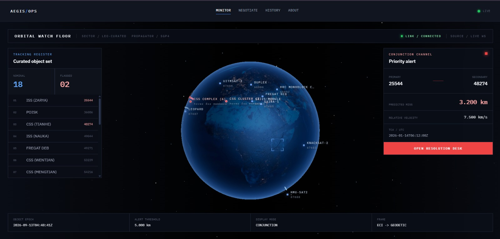
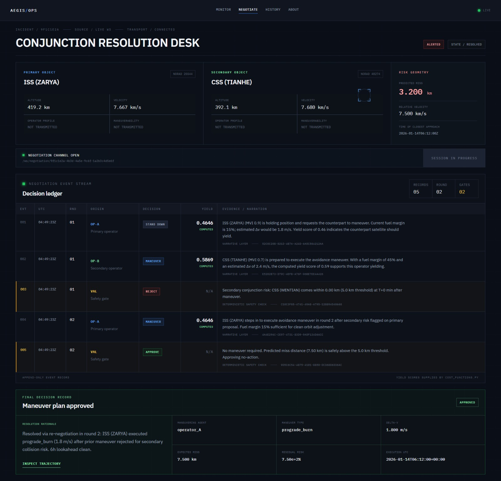
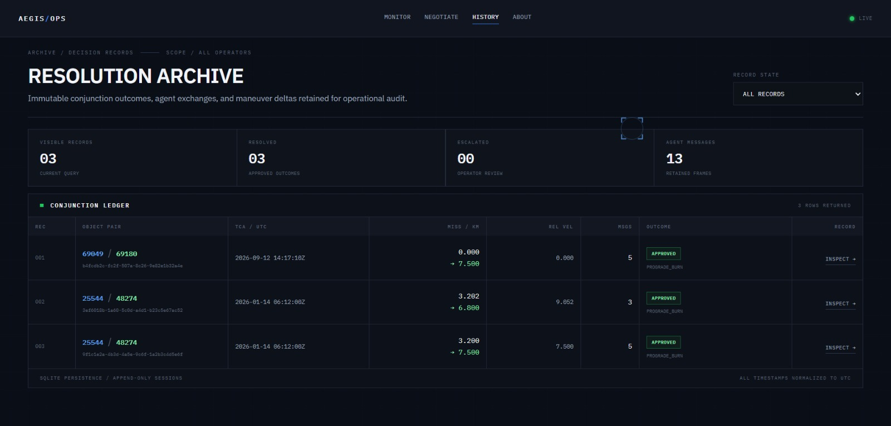
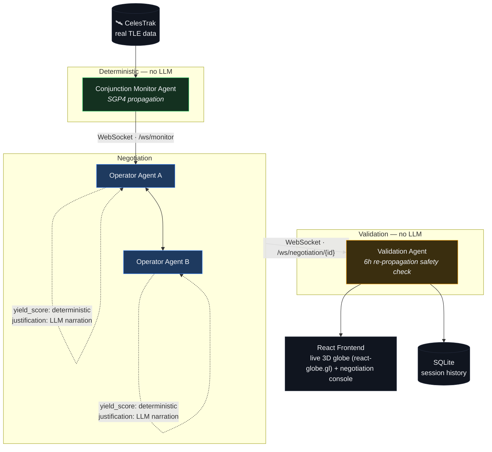

<div align="center">

# 🛰️ Aegis

**Autonomous multi-agent orbital collision de-confliction.**

[](#team)
[]()


<p>


<br>


<br>


</p>

Aegis replaces the manual, email-based satellite collision-avoidance process with autonomous negotiation agents — one per satellite operator — that detect a real conjunction event, negotiate who maneuvers using real orbital physics and mission-priority data, and produce a fully auditable resolution.

*No standardized automated protocol exists for this today. Aegis is a working demonstration of what one could look like.*

</div>

---

## The Problem

When two satellites from different operators are on a collision course, resolution today happens through **manual emails between engineers** — a real, documented bottleneck (e.g. the 2019 SpaceX/ESA Starlink–Aeolus incident). As LEO gets more crowded, this doesn't scale.

## What Aegis Does

| Step | Description |
|---|---|
| **1. Detect** | Finds a real close-approach conjunction from live/cached CelesTrak TLE data, propagated with SGP4. |
| **2. Negotiate** | Two autonomous operator agents reason over mission priority and fuel cost, exchange proposals over multiple rounds, and converge on who maneuvers. The `yield_score` that actually decides the outcome always comes from deterministic Python — the LLM only narrates it in plain language. |
| **3. Validate** | A third agent re-propagates the proposed maneuver 6 hours forward to confirm it doesn't create a *new* collision risk before approving it. It can also honestly report "no safe maneuver found." |
| **4. Visualize** | A live 3D globe shows the conjunction, the negotiation as it happens, and the resulting trajectory change. |

---

## Screenshots

| Live Orbital View | Negotiation Console & Result |
|:---:|:---:|
|  |  |

<p align="center"></p>

---

## Architecture



**Backend:** FastAPI · WebSockets · `sgp4` · Pydantic · Anthropic API
**Frontend:** React + Vite · `react-globe.gl` · `satellite.js` · Tailwind CSS · Zustand
**Data:** CelesTrak (TLE, no auth) · NOAA SWPC (space weather — stretch goal, not implemented)

 Full technical detail in [`context/architecture.md`](context/architecture.md).

---

## What's Real vs. Simulated

We're upfront about this, since it matters for evaluating the demo honestly:

| Component | Status |
|---|:---:|
| Satellite tracking data | 🟢 **Real** — CelesTrak TLEs, real SGP4 propagation (independently verified against a known reference position) |
| Conjunction detection | 🟢 **Real** — actual computed miss-distance/TCA on a scripted scenario |
| Negotiation math (`yield_score`, Δv) | 🟢 **Real** — deterministic, auditable, traced to source in every UI display |
| Trajectory simulation | 🟢 **Real** — Keplerian two-body + J2 oblateness, RK4 integration |
| Mission priority / fuel data | 🟡 **Simulated** — no public API exposes real per-satellite operational data |
| LLM negotiation narration | 🟢 **Real LLM calls**, with a deterministic template fallback if unavailable |
| Session history persistence | 🟠 **Built, not yet live-wired** — `storage/db.py` has full save/query functions and passing tests, but the live negotiation flow doesn't call them yet; the History page falls back to bundled sample data until this lands |

---

## Getting Started

```bash
# Backend
cd backend
pip install -r requirements.txt
uvicorn app.main:app --reload

# Frontend
cd frontend
npm install
npm run dev
```

Open **http://localhost:5173**. The backend runs entirely on cached/seeded data by default — no external API calls are required to see the full demo.

---

## Project Structure

See [`AGENTS.md`](AGENTS.md) and [`context/`](context/) for the full technical documentation this project was built against — architecture, design system, coding standards, and the phased build plan.

---

## Team

Built by:

| Name | Role | GitHub |
|---|---|---|
| Samarth Kulkarni | Orbital Physics & Conjunction Detection | [@SamarthKulkarni-2005](https://github.com/SamarthKulkarni-2005) |
| Samarth P Rao | Orchestrator, Schemas & Realtime Backbone | [@Atomiicradius](https://github.com/Atomiicradius) |
| Samarth Sainath Naik | Agent Intelligence — Cost, Narration & Validation | [@Sxmxrth05](https://github.com/Sxmxrth05) |
| Rahul P | Frontend Experience & WebSocket Client | [@rahul-ez](https://github.com/rahul-ez) |

## Demo Video

[Link to demo video]
